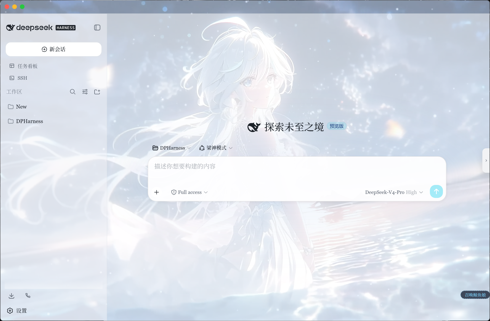
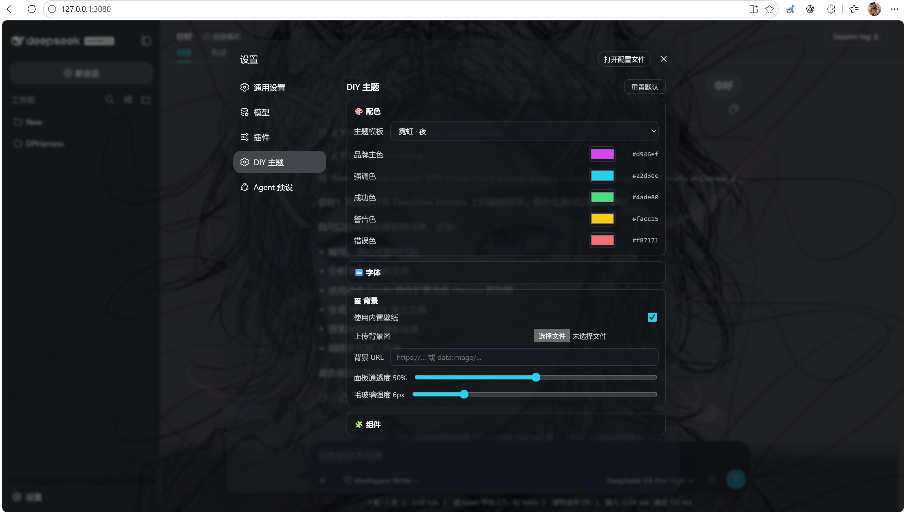

# dsh-ui-customizer

一个用于 [`dsh web`](https://github.com/deepseek-ai/deepseek-harness) 的全方面 DIY 主题插件。
不改任何源码，装进 web profile 后，在 **设置 → DIY 主题** 里实时调整配色、字体、背景、圆角，
配置持久化到浏览器 localStorage。另带一个 **Electron 桌面壳**（`desktop/`），可把 DSH 界面包成独立窗口。

## 特性

- **配色**：8 套皮肤（一键套用整套配色）+ 品牌/强调/成功/警告/错误 5 个取色器，从 5 色派生语义 token + 中性色调（蓝灰/冷灰/暖灰/石墨）统一派生文字/边框/代码块/引用色
- **字体**：界面字体 + 代码字体（下拉选择）+ 整体缩放 80–140% + 字号缩放 80–130%
- **背景**：内置壁纸 / 上传图片（前端压缩到 1920px JPEG）/ 图片 URL / **视频背景（mp4 上传或 URL）** / 面板通透度 / 毛玻璃；上传的图片/视频存 **IndexedDB**，配置只存 `idb:` 引用，刷新后自动恢复
- **组件**：圆角 0–24px + 阴影层级（无/轻/标准/强）
- **皮肤中心**：选择即试穿、满意再应用、未保存可还原
- **我的方案**：把当前整套配置保存成命名方案，一键快捷切换
- **可读性**：覆盖层（对话框/菜单/输入/提示）固定高不透明，通透度只作用于环境背景，文字始终清晰

## 截图





## 安装

```powershell
dsh plugin --profile web add "git+https://github.com/Final-LX/dsh-ui-customizer"
```

然后在 `~\.dsh\profiles\web\cordis.patch.yml` 里登记 loader 行，并重启：

```yaml
- insert:
    - id: ui-customizer
      name: dsh-ui-customizer
```

```powershell
npx @deepseek-ai/dsh web
```

> 本地源码安装/开发：克隆本仓库后，在目录里运行 `.\install.ps1` 一键安装，或
> `dsh plugin --profile web add "file:C:/path/to/dsh-ui-customizer"` + 手动登记上面那行。
> `dsh` 不在 PATH 时用 `npx @deepseek-ai/dsh plugin --profile web add ...` 代替。
> pnpm 对 `file:` 依赖默认是**拷贝**（非符号链接），改源码后需重新 `add` 刷新安装副本。

## 使用

打开 Web GUI → 右上角 **设置** → 左侧导航 **DIY 主题**，即可按分组调整。

顶部有「启用 DIY 主题」总开关：关闭后本插件完全不生效（覆盖全部撤销，方便让 dsh-web-ui 的皮肤中心接管），打开后恢复。

所有改动都是「试穿」：实时预览但不落盘。满意后点右上角「应用」保存，「还原」撤销未保存的更改。配置存在浏览器 localStorage（`dsh-ui-customizer:config:v3`）；上传的图片/视频本体存在浏览器 **IndexedDB**（`dsh-ui-customizer` / `media`），配置里只存 `idb:` 引用，所以刷新后能自动恢复，也不占 localStorage 的 5MB 配额。

| 分组 | 控件 | 说明 |
|---|---|---|
| （总开关） | 启用 DIY 主题 | 关闭后撤销全部覆盖，不生效 |
| 皮肤中心 | 8 张色板卡片 | 点选即试穿整套配色/通透度/毛玻璃/圆角，选中高亮 |
| 配色 | 品牌/强调/成功/警告/错误 | 5 个取色器，带 hex 值显示 |
| | 中性色调 | 蓝灰/冷灰/暖灰/石墨，统一文字、边框、代码块、引用色 |
| 字体 | 界面字体 / 代码字体 | 下拉选择预设字体栈 |
| | 整体缩放 | 80–140%，整体放大缩小界面 |
| 背景 | 使用内置壁纸 | 开关内嵌壁纸 |
| | 上传背景图 | 选本地图片，前端压缩后存 IndexedDB，配置存 idb: 引用 |
| | 上传视频 | 选 mp4，存 IndexedDB，刷新后自动恢复 |
| | 背景 URL | 填网络图或 data URI |
| | 面板通透度 | 0–100%，越小背景越清楚 |
| | 毛玻璃强度 | 0–30px，0 为关闭模糊（最省性能） |
| 组件 | 阴影层级 | 无/轻/标准/强，作用于卡片/弹层/悬浮 |
| | 圆角 | 0–24px，作用于按钮/输入/对话框等 |

## 与其他插件共存（dsh-web-ui）

本插件可以和 [dsh-web-ui](https://github.com/zhu1090093659/dsh-web-ui) 全家桶并存：**功能用 dsh-web-ui，主题定制用本插件**。

```powershell
dsh plugin --profile web add @linxin666/dsh-web-ui-all   # 功能全家桶（看板/Git/SSH/移动端/宠物…）
dsh plugin --profile web add "git+https://github.com/Final-LX/dsh-ui-customizer"   # 本插件：DIY 主题
```

两者都会改主题 token，想切换就靠本插件的「启用 DIY 主题」开关：

- **开**：本插件生效，DIY 皮肤/配色接管主题
- **关**：本插件完全撤销，改用 dsh-web-ui 的皮肤中心

这样就避免了两套主题同时生效、互相覆盖的问题。

## 测试

```powershell
npm test
# 等价于：
node tools/test-client.cjs   # 无头测试：factory+apply+渲染+防抖+上传
node tools/test-render.cjs   # 真实 React 渲染测试
node tools/test-idb.cjs      # IndexedDB 媒体存储：上传→引用→刷新恢复
```

Token 兼容性检查（需先装官方 DSH 拉取 `dsh-web-frontend` 的 dist CSS，CI 里跑）：

```powershell
pnpm add -D --ignore-scripts "@deepseek-ai/dsh@latest"
node tools/test-tokens.cjs   # 逐个核对覆盖的 --dsw-* / --ds-* token 是否仍存在于官方 dist
```

## 桌面 App 与 CI（同步官方更新）

- **桌面壳**：`desktop/` 里的 Electron 客户端，本地起 `dsh web` 并开原生窗口；带首次引导（自动装插件，幂等）、固定端口（保证 localStorage/IndexedDB 跨启动持久）、日志落盘、崩溃恢复、托盘，已出 Windows 安装包。详见 `desktop/README.md`。
- **API key 与官方一致**：桌面壳**不**自动填 key、也不代管密钥——新用户首次打开窗口会进入 DSH 自带的「填 API key」引导（或自行设置 `DEEPSEEK_API_KEY` 环境变量），与官方 `dsh web` 行为完全一致。
- **CI**：`.github/workflows/ci.yml` 用 GitHub Actions 跑「官方 latest + 固定版」双矩阵，执行上面的测试 + token 比对；每天 UTC 03:00 定时跑，官方 RC 版契约一变（token 改名/删除）就会红灯，能抢在用户遇到前修复。

## 换壁纸

```powershell
npm run wallpaper -- "C:\path\to\image.png"
```

图片会被压成 1920px JPEG，写入 `assets/wallpaper.txt` 并内嵌进 `lib/client.js`，
然后重新 `add` + 重启。若只改了壁纸文件想重新内嵌：`node tools/inject-wallpaper.cjs`。

## 关键契约（跨 DSH 版本升级时核对）

- `exports` 必须暴露 `"./package.json"`：`client-modules` 靠 `require.resolve('<pkg>/package.json')`
  读取 `dsh.client` 声明，缺失会被判为「非客户端包」。
- 客户端 bundle 是 classic `<script>`，必须以 `window.__ModuleLoader__.load({...})` 注册 factory。
- `package.json` 的 `dsh.client` 需含 `{ platform: "web", immediately: true, inject: [...] }`。

## 目录结构

```
dsh-ui-customizer/
├── package.json          # exports["./client"] + dsh.client + peerDeps + scripts
├── install.ps1           # 一键安装
├── docs/                 # 截图（README 引用）
├── assets/wallpaper.txt  # 壁纸 data URI（set-wallpaper.cjs 生成）
├── .github/workflows/ci.yml  # CI：官方 latest + 固定版矩阵 + token 比对
├── desktop/              # Electron 桌面壳（main.js + package.json + README）
├── tools/
│   ├── set-wallpaper.cjs    # 换壁纸（压缩 + 内嵌）
│   ├── inject-wallpaper.cjs # 仅重新内嵌 assets/wallpaper.txt
│   ├── test-client.cjs      # 无头测试
│   ├── test-render.cjs      # 真实 React 渲染测试
│   ├── test-idb.cjs         # IndexedDB 媒体存储测试
│   └── test-tokens.cjs      # token 兼容性检查（对比官方 dist）
└── lib/
    ├── index.js          # 宿主侧 no-op 入口
    └── client.js         # 浏览器 bundle：设置面板 + 主题 + CSS
```
