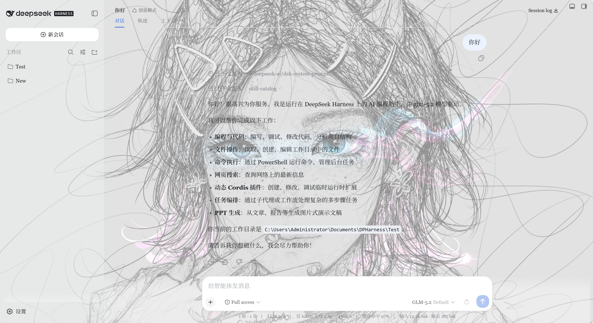
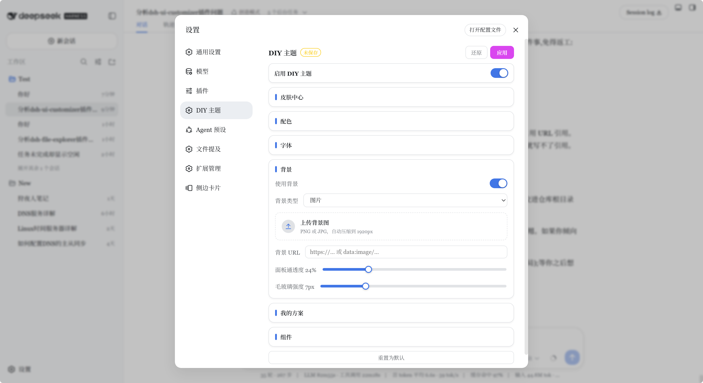
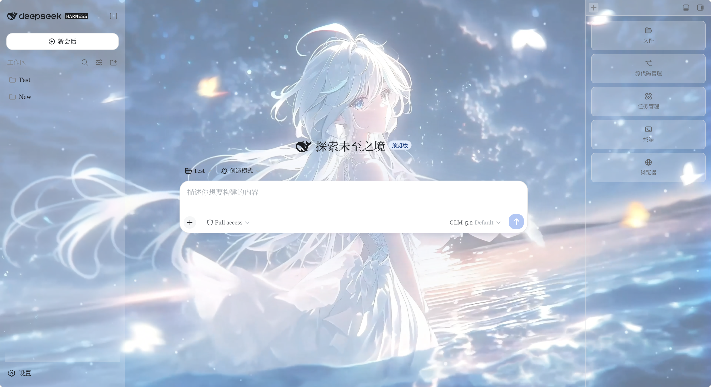

<p align="center">
  
  
  <a href="https://github.com/Final-LX/dsh-ui-customizer/blob/main/README.md"></a>
  <a href="https://github.com/Final-LX/dsh-ui-customizer/blob/main/README.zh-CN.md"></a>
  <a href="https://github.com/Final-LX/dsh-ui-customizer/blob/main/README.zh-TW.md"></a>
  <a href="https://github.com/Final-LX/dsh-ui-customizer/blob/main/README.ja.md"></a>
  
  
</p>

<p align="center">
  <strong>dsh-ui-customizer</strong> —— 为 <a href="https://github.com/deepseek-ai/deepseek-harness">DeepSeek Harness（DSH）</a> Web 端提供的可视化、零代码主题定制插件。
  在「设置 → DIY 主题」里调整配色、字体、背景与组件样式，改完立即可见。
</p>

<p align="center">
  
</p>

<p align="center">
  
</p>

<p align="center">
  <a href="https://blog.lonelybear.cn/content/media/2026/08/videos-1.mp4" target="_blank" rel="noopener" title="点击播放演示视频">
    
  </a>
</p>

> ▶️ **演示视频：** 点击上方封面图，在新标签页打开播放。

---

**语言：** [English](README.md) · [简体中文](README.zh-CN.md) · [繁體中文](README.zh-TW.md) · [日本語](README.ja.md)

---

## ✨ 功能一览

| 分组 | 可以调什么 | 说明 |
|---|---|---|
| **总开关** | 启用 / 关闭 DIY 主题 | 关闭后撤销本插件的全部覆盖 |
| **皮肤中心** | 8 套一键预设皮肤 | 选完后仍可继续微调 |
| **配色** | 品牌、强调、成功、警告、错误色 | 颜色选择器 + 十六进制 |
| **配色** | 中性色调方向 | 蓝灰、冷灰、暖灰、石墨 |
| **字体** | 界面字体、代码字体 | 预设字体栈 |
| **字体** | 整体缩放（80–140%）、字号缩放（80–130%） | 两个独立控制 |
| **背景** | 图片 URL（`http(s):` 或 `data:`） | 保存在浏览器本地 |
| **背景** | 面板通透度、毛玻璃强度 | 数值过高会增加 GPU/CPU 负担 |
| **组件** | 阴影层级、圆角 | 调整层次感与圆润度 |
| **我的方案** | 保存并切换整套主题 | 为你的设置命名后随时取用 |

> 插件**以可读性为先**：环境表面（主背景、侧边栏）随你的通透度设置变透明露出背景；覆盖层（对话框、菜单、输入框、提示气泡）则固定保持约 94% 不透明，保证弹窗里文字始终清晰。

## 🚀 快速开始

> 运行 DSH Web profile 需要 **Node.js**（含 `npx`）。最简单的路径不需要 git 或 pnpm。

### 方案 A：安装脚本（只需 Node.js）

1. 从 GitHub 下载本仓库的 **ZIP** 并解压。
2. 在 PowerShell 中进入解压后的目录，执行：

   ```powershell
   .\install-web.ps1
   ```

3. 启动网页版：

   ```powershell
   npx @deepseek-ai/dsh web
   ```

4. 打开浏览器里的「设置 → DIY 主题」。

脚本会把插件复制到 `~\.dsh\profiles\web\node_modules\dsh-ui-customizer`，并在 `cordis.patch.yml` 中登记 loader。脚本可重复运行。

> **提示“无法加载……未进行数字签名 / 无法执行脚本”？** 这是 PowerShell 默认执行策略拦截了未签名脚本。只需放宽当前窗口的策略再跑（只影响当前窗口，关掉即恢复，安全）：
> ```powershell
> Set-ExecutionPolicy -Scope Process -ExecutionPolicy Bypass
> .\install-web.ps1
> ```
> 或一行直接跑：
> ```powershell
> powershell -ExecutionPolicy Bypass -File .\install-web.ps1
> ```

### 方案 B：DSH 插件命令（已装 git 和 pnpm）

```powershell
dsh plugin --profile web add "git+https://github.com/Final-LX/dsh-ui-customizer"
```

如果命令行找不到 `dsh`：

```powershell
npx @deepseek-ai/dsh plugin --profile web add "git+https://github.com/Final-LX/dsh-ui-customizer"
```

`dsh plugin add` 只装依赖——本插件是 classic bundle（靠 loader 行激活，不是 `dsh.bundle`），所以**必须**手动登记 loader 才会生效。打开：

```text
%USERPROFILE%\.dsh\profiles\web\cordis.patch.yml
```

确认包含：

```yaml
- insert:
    - id: ui-customizer
      name: dsh-ui-customizer
```

然后**完全退出并重启** DSH Web（`npx @deepseek-ai/dsh web`），再刷新页面。
如果只跑了 `dsh plugin add` 没加 loader 行，面板不会出现。

## 🤖 让 AI 帮你安装（复制粘贴）

想让 AI 代理（如 DeepSeek Harness、Claude、ChatGPT）替你装好？复制下面任意一段提示词发给你的 AI 即可，两段都自包含。

**中文提示词：**

```text
帮我把 dsh-ui-customizer 主题插件安装到 DeepSeek Harness（DSH）Web 里。
步骤：
1. 确认本机已装 Node.js（含 npx）。
2. 启动 DSH Web：npx @deepseek-ai/dsh web（首次运行会初始化 web profile）。
3. 从 git 安装插件：npx @deepseek-ai/dsh plugin --profile web add "git+https://github.com/Final-LX/dsh-ui-customizer"
4. 本插件是 classic bundle（没有 dsh.bundle），dsh plugin add 不会自动激活它。
   打开 %USERPROFILE%\.dsh\profiles\web\cordis.patch.yml，确认包含：
     - insert:
         - id: ui-customizer
           name: dsh-ui-customizer
5. 完全重启 DSH Web（先停掉，再跑 npx @deepseek-ai/dsh web），然后刷新浏览器。
6. 打开「设置 -> DIY 主题」确认面板出现。
如果失败，把报错和 cordis.patch.yml 的内容给我看，并告诉我怎么修。
```

**English prompt:**

```text
Help me install the dsh-ui-customizer theme plugin into my DeepSeek Harness (DSH) Web.
Steps:
1. Make sure I have Node.js (with npx).
2. Start DSH Web with: npx @deepseek-ai/dsh web  (this initializes the "web" profile on first run).
3. Install the plugin from git:  npx @deepseek-ai/dsh plugin --profile web add "git+https://github.com/Final-LX/dsh-ui-customizer"
4. This plugin is a classic bundle (no dsh.bundle), so dsh plugin add will NOT activate it on its own.
   Open %USERPROFILE%\.dsh\profiles\web\cordis.patch.yml and make sure it contains:
     - insert:
         - id: ui-customizer
           name: dsh-ui-customizer
5. Fully restart DSH Web (stop and run "npx @deepseek-ai/dsh web" again), then refresh the browser.
6. Open Settings -> DIY Theme to confirm the panel appears.
If anything fails, show me the error and the contents of cordis.patch.yml, and tell me how to fix it.
```

## 🖼️ 首次使用与面板操作

1. 启动 DSH，完成内置的模型 / API key 引导。
2. 打开右上角「设置」→「DIY 主题」。
3. 改动会**实时预览**（试穿）。
4. 点「应用」保存，「还原」撤销未保存的修改，「重置为默认」恢复出厂值。

## 🔒 数据、安全与兼容性

- 主题配置和方案保存在 **`localStorage`**；如有上传媒体则存于 **IndexedDB**。本插件不会把主题配置上传到 DSH 服务端。
- 远程图片 URL 能否加载，取决于协议、浏览器安全策略及服务器的 CORS / Referrer 响应。
- DSH 迭代很快，官方 token、slot 和页面结构变化可能影响兼容性。若升级 DSH 后某项设置失效，请运行测试并反馈给作者（见故障排查）。

## ❓ 常见问题

**为什么主题在不同浏览器之间不同步？**
主题数据属于浏览器（localStorage/IndexedDB）。不同浏览器 / profile 各自保存；DSH 服务端的会话数据由服务端统一管理，所以可以共享。

**改了没生效？**
需要点「应用」才保存。若点了也没效果，多半是 DSH 版本与插件的 token 集发生了漂移——更新插件或反馈 token 缺失（见故障排查）。

**方案能分享吗？**
目前方案保存在本地，不支持直接导出分享；你可以记下颜色和缩放数值手动重建。

## 🛠️ 故障排查

| 症状 | 可能原因 / 处理 |
|---|---|
| 安装后找不到面板 | DSH 未完全重启，或 `cordis.patch.yml` 缺 loader 行。编辑后重启 `dsh web` 再刷新。 |
| 主题生效但某些颜色不对 | 官方 token 跨版本变化。`npm test`（含 `tools/test-tokens.cjs`）会暴露缺失项，把列出的 token 反馈给作者。 |
| 毛玻璃/大图感觉卡 | 调低面板通透度 / 毛玻璃强度，或换更小的背景图。 |
| 背景 URL 加载不出 | 检查协议（仅 `http(s)`）以及远端服务器的 CORS / Referrer 策略。 |

## 👩‍💻 开发者说明

```text
dsh-ui-customizer/
├── lib/client.js                 # 浏览器端 classic bundle（主题逻辑 + 设置 UI）
├── lib/index.js                  # 宿主侧入口（本浏览器端插件为 no-op）
├── package.json                  # 插件元数据 + dsh.client 配置
├── tools/                        # 测试工具
├── docs/                         # 截图与介绍文章
├── install-web.ps1               # 只需 Node.js 的网页端安装脚本
└── README.md                     # 本文档（及各语言版本）
```

运行测试：

```powershell
npm test
```

等价于运行 `test-client`、`test-render`、`test-idb` 和 `test-tokens`。最后一个需要已安装 `@deepseek-ai/dsh`（它把插件的白名单 token 与官方 dist CSS 对拍）；未安装时会跳过而非失败，所以 `npm test` 在任何环境都能跑。CI 会对 `latest` 与固定版本都运行它，尽早捕捉 token 漂移。

关键插件契约：

- `package.json` 必须导出 `./package.json`，以便 DSH 读取 `dsh.client`。
- 客户端 bundle 以 `window.__ModuleLoader__.load({...})` 注册。
- `dsh.client` 声明 `platform: "web"`、`immediately: true` 及所需 `inject` 服务。

## 📄 许可证

[MIT](LICENSE) —— © 2025 Final-LX。欢迎 Issue、PR 与 Star！
